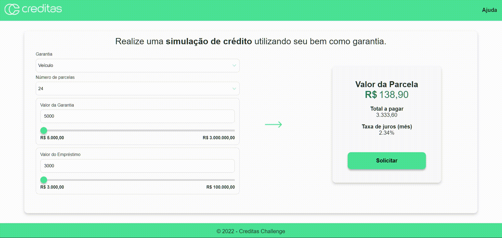
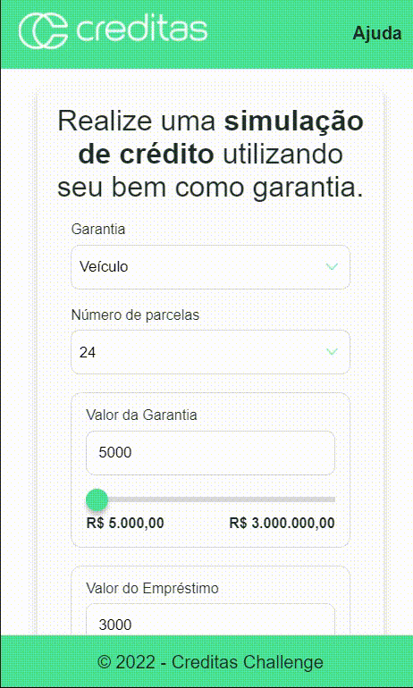

<div align="center">
  <h1>Challenge Creditas</h1>
    
  
  
 
</div>

## Descrição ✍️

Esse projeto foi feito utilizando como base o [desafio da Creditas](https://github.com/Creditas/challenge/tree/master/frontend/individual-assignment), nesse desafio a propósta era fazer algumas melhorar no código utilizando apenas HTML, JS e CSS.

Essa aplicação simula crédito utilizando seu imóvel ou veiculo como garantia.

---

## Preview 🔴






---

## Instalação 📦

```sh
## instalar dependências
$ npm i

## inicializar a aplicação
$ npm run start

## rodar testes unitários
$ npm run test

```

A aplicação roda na porta 4000.

---

## Desafios 🏆

- [x] site responsivo
- [x] melhoras na interface
- [x] testes unitários
- [x] melhoras na estilização
- [x] melhoras na estrutura do HTML
- [x] implementação da silumação de crédito para imóveis


---

## Tecnologias ⚙️

- html
- css
- javascript
- jest

---

<div align="center">

Made by Janapc 🤘 [Get in touch!](https://www.linkedin.com/in/janaina-pedrina/)

</div>
